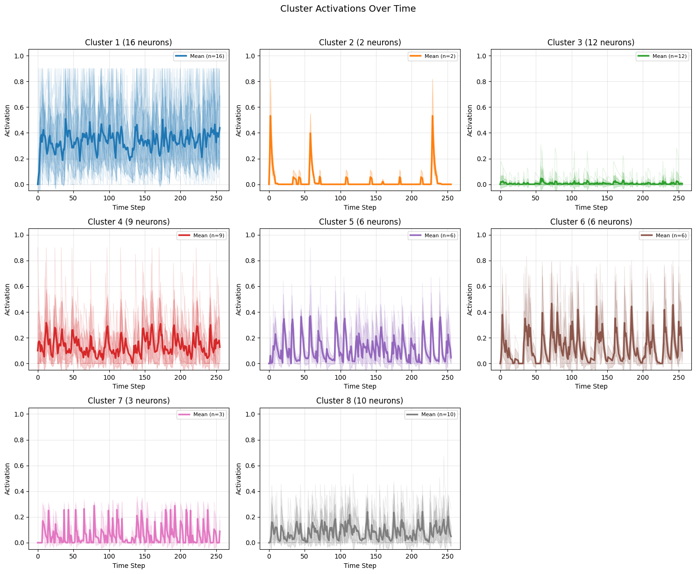
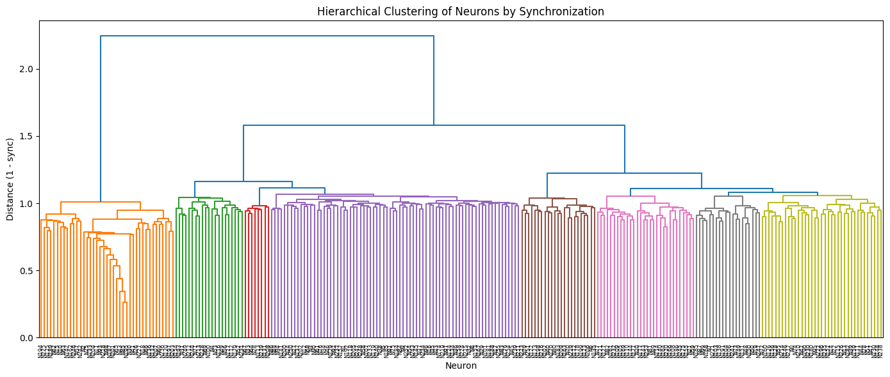
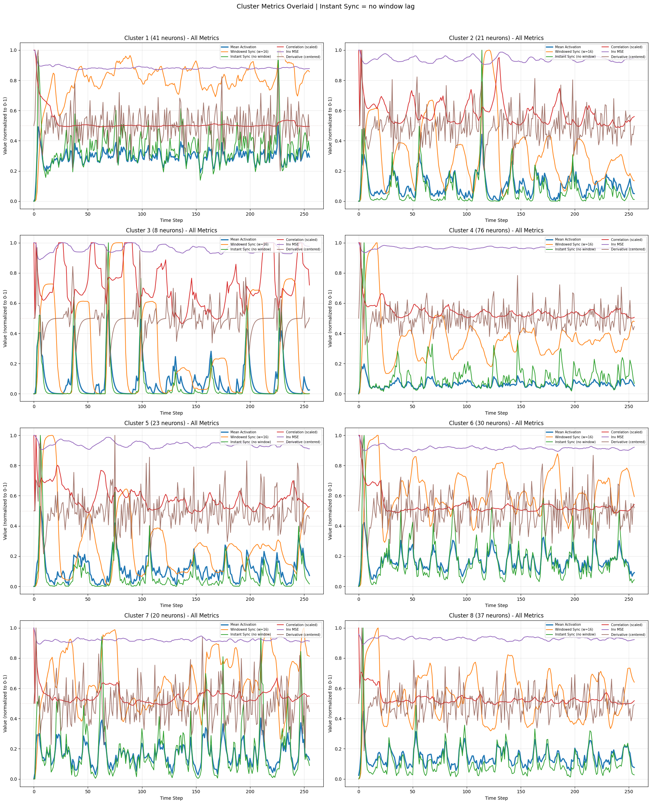
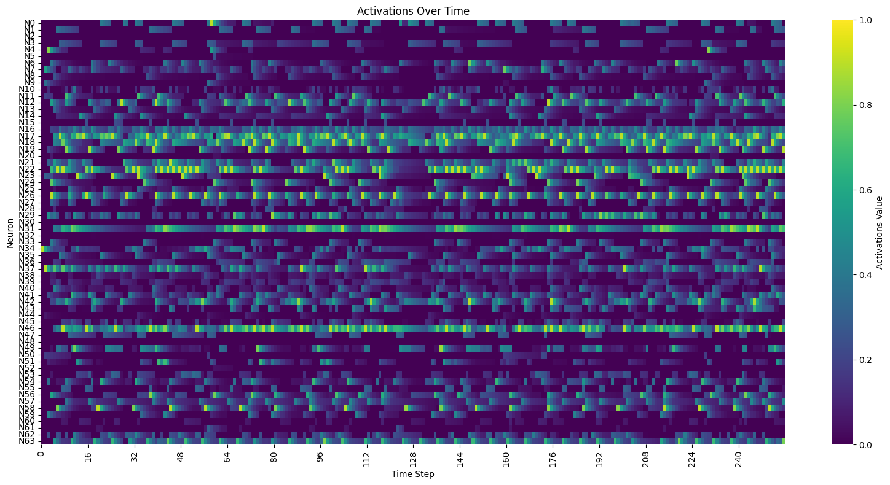

# Lab Notes: Synchronization, Clustering, and Modular Networks

**Date:** 2026-01-08

## Overview

Exploring synchronization, clustering, and modular networks in spiking neural networks. The core question: how to identify stable, long-term relationships between neurons in a network.

## CTM Paper: Whole-Run vs Windowed Sync

Investigated how the CTM (Continuous Thought Machines) paper measures synchronization.

**Finding:** CTM computes sync **cumulatively over the whole run**, not windowed:

```
S^t = Z^t · (Z^t)^T
```

Where `Z^t` is the full history of activations from t=0 to t. This accumulates over time.

**Windowed sync would create dynamic clusters** — different groupings at each time window. The problem: there's always _some_ group activating together at any moment, so the "top cluster" would just be "whoever's currently active." This is somewhat tautological and loses the ability to identify stable, long-term relationships.

Whole-run sync finds neurons that have fired together **consistently over the full trajectory**.

## Cluster Count vs Network Size

With 256 neurons and 8 clusters, observed some clusters are active while others are dormant.

**Dendrogram analysis** revealed only 2-3 "natural" clusters — large vertical gaps at heights ~1.5-2.2, but gradual merging below ~1.0. The current 8 clusters are already cutting into regions with no strong natural boundaries.

Going to 12 clusters would create more weak/arbitrary groupings.

**Key insight:** Number of natural clusters depends on connectivity structure, not just network size. With 10% random connectivity, the network is fully connected (well above the Erdős–Rényi threshold of ~2% for N=256), so activity propagates everywhere.

## ESN-Style Warmup for Sync Calculation

**Problem:** Initial stimulus (activating most-connected neuron) creates a large spike that dominates the cumulative sync matrix. This captures "who got hit by the initial wave" rather than steady-state dynamics.

**Solution:** Added `warmup` parameter to `compute_synchronization_over_time()`:

```python
def compute_synchronization_over_time(history, data_type="activations", warmup=0):
    # Skip first `warmup` timesteps when computing sync
    start = min(warmup, t - 1)
    Z_t = activations[start:t, :].T
```

Using `warmup = steps // 8` (32 steps for 256-step runs).

## Random Seed for Reproducibility

Added `RANDOM_SEED = 42` with `np.random.seed(RANDOM_SEED)` before all randomization calls. Enables repeatable experiments.

## Modular Network Structure

To create networks with more independent clusters, implemented `randomize_modular_weights()`:

```python
network.randomize_modular_weights(
    n_modules=4,
    intra_sparsity=0.25,  # 25% connections within modules
    inter_sparsity=0.05,  # 5% connections between modules
    scale=0.4
)
```

**Module assignment is by neuron index:**

- Module 0: neurons 0-63
- Module 1: neurons 64-127
- Module 2: neurons 128-191
- Module 3: neurons 192-255

Weight VALUES are still random gaussian — only the SPARSITY PATTERN is modular.

### Per-Module Stimulation

With modular structure, single-point stimulation doesn't reach all modules. Added `manual_activate_most_weighted_per_module()` to stimulate the most-connected neuron in each module.

### Interesting Finding: Clusters ≠ Modules

Sync-based clusters don't perfectly follow module boundaries. This means clustering captures **functional organization** (who actually fires together) rather than just **structural organization** (who's connected).

Divergence caused by:

- Inter-module connections creating cross-module correlations
- Random thresholds affecting which neurons actually fire
- Cascade patterns crossing module boundaries
- Warmup removing topology-driven initial burst

## Key Insight: Output Readouts ARE Sync Detectors

The clustering analysis was my addition to understand the network. But realized:

**Output readouts already implicitly measure synchronization.**

If output is: `o_k = Σ w_{i,k} · a_i`

Then `o_k` is maximized when all neurons with high `w_{i,k}` fire **together** (synchronously).

| Approach        | What it does                                               |
| --------------- | ---------------------------------------------------------- |
| Sync clustering | Discovers which neurons fire together (analysis)           |
| Output readout  | Responds when its weighted inputs fire together (function) |

**Implication for multiple voices:** Don't need N natural clusters to get N independent outputs. Just need N different weight patterns in `output_weights`. Each output is its own "sync readout" over its connected neurons.

## Alternative Approaches for Multiple Sync Readouts

If needed more independent readouts than natural clusters allow:

1. **Different time scales** — instantaneous vs short window vs long window sync
2. **Neuron pair selection (CTM-style)** — D×(D+1)/2 possible pairs >> neurons; each readout selects different pairs
3. **Hierarchical cuts** — same dendrogram, different cut heights for different readouts
4. **Orthogonal projections** — PCA/SVD on sync matrix; each PC is independent sync mode
5. **Phase vs magnitude** — correlation-based (normalized) vs dot-product-based readouts

## Code Changes Summary

1. `RANDOM_SEED` and `np.random.seed()` for reproducibility
2. `warmup` parameter in `compute_synchronization_over_time()`
3. `randomize_modular_weights()` method for block-structured connectivity
4. `manual_activate_most_weighted_per_module()` for per-module stimulation

## Metrics for Measuring "Sameness" in Clusters

Implemented and compared multiple metrics for within-cluster similarity:

| Metric                 | Formula                   | Captures                        | Limitation                      |
| ---------------------- | ------------------------- | ------------------------------- | ------------------------------- |
| **Windowed Sync**      | `Z @ Z.T` (dot product)   | Co-activation magnitude         | Window creates lag/fatter peaks |
| **Correlation**        | `corrcoef()`              | Pattern shape similarity        | Undefined when variance=0       |
| **Inverse MSE**        | `1/(1+MSE)`               | Sameness including both at zero |                                 |
| **Instantaneous Sync** | `mean(aᵢ × aⱼ)` at each t | Real-time co-activation         | Can be noisy                    |

**Key finding:** Correlation is often OUT OF PHASE with activation! During spike events:

- Neurons co-activate (high sync) but have different trajectories (low correlation)
- After spikes, all neurons decay together → trajectories align → correlation rises

**Why dot product captures sync (Hebbian connection):**

```
a · b = Σ (aᵢ × bᵢ)
```

Product is only large when BOTH neurons are active at the same time. This is exactly Hebbian: "neurons that fire together wire together."

## Window Size Problem

**Issue:** Using windowed sync for note gating means window_size becomes an artifact controlling gate duration—not network dynamics.

**Solutions:**

1. **Instantaneous sync** — no window, duration comes from actual network dynamics
2. **Edge detection** — detect threshold crossings, not sustained levels
3. **Mean activation + threshold** — simplest, direct mapping

## Autonomous Generation vs Transformation

Most neural network literature is **input → output mapping**. This project is different:

```
Standard:   INPUT ──> NETWORK ──> OUTPUT
This:       INITIAL CONDITION ──> NETWORK (autonomous) ──> OUTPUT
```

This is more like:

- Dynamical systems / oscillators
- Central Pattern Generators (CPGs) in robotics
- How real brains compose (no external input when imagining)

The "composition" is encoded in the **weights and topology**, not in any input. Evolution optimizes weights to produce desired output trajectories.

Related work: "free-running" or "autonomous" reservoir computing, Echo State Networks in generative mode.

## CTM Attention Mechanism

CTM uses **synchronization as a query** for cross-attention:

```python
query = sync_representation  # From sync matrix
attention_weights = softmax(query @ keys.T)  # Keys from input
output = attention_weights @ values
```

The network decides what to attend to based on which neurons are firing together. More biologically plausible than learned Q/K/V matrices.

## Multi-Parameter Note Control Challenge

**Problem:** All musical parameters derived from same signal (cluster activation) → inherently correlated:

- Onset = when activation rises
- Duration = how long activation high
- Pitch = cluster ID
- Volume = activation level

All locked together: loud = spiking = short duration = staccato only.

**Approaches from literature for independence:**

1. **Multiple readouts** — train separate linear readouts for each parameter
2. **Multi-scale integration** — fast decay → attacks, slow decay → sustain:
   ```python
   sustain[t] = 0.99 * sustain[t-1] + 0.01 * activation[t]
   ```
3. **Cluster role assignment** — some clusters → pitch, others → envelope control
4. **Phase-amplitude separation** — amplitude → volume, phase relationships → timing
5. **ADSR envelope followers** — release parameter could be second cluster's output

**For evolution-based approach:** Assign cluster roles and let fitness function reward statistical independence between onset, duration, pitch, volume.

## Code Additions (Metrics & Visualization)

1. `compute_windowed_coherence()` — correlation-based coherence
2. `compute_windowed_sync()` — dot-product sync over window
3. `compute_windowed_inv_mse()` — inverse MSE for sameness
4. `compute_instantaneous_sync()` — no window, real-time co-activation
5. `compute_activation_derivative()` — rising/falling detection
6. `plot_cluster_metrics_overlaid()` — all metrics on one graph per cluster

## Plots






## Open Questions

- How to optimally choose output weight patterns for diverse/independent responses?
- Does training readouts (ESN-style) naturally discover sync-sensitive patterns?
- What's the relationship between spectral radius per module and cluster quality?
- Can cluster roles (pitch vs envelope) emerge from evolution, or must be designed?
- What temporal integration constants produce musically useful note durations?
- How to evaluate "interestingness" of autonomous compositions for fitness function?
