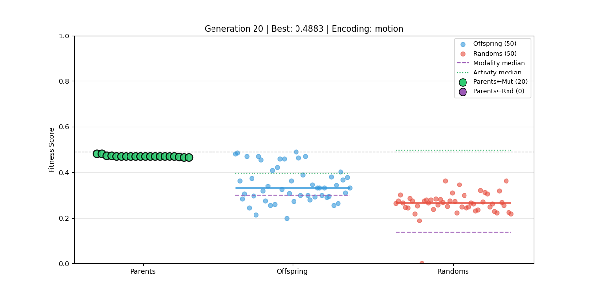
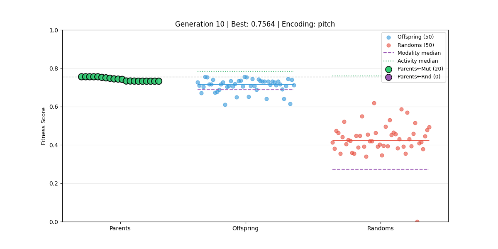
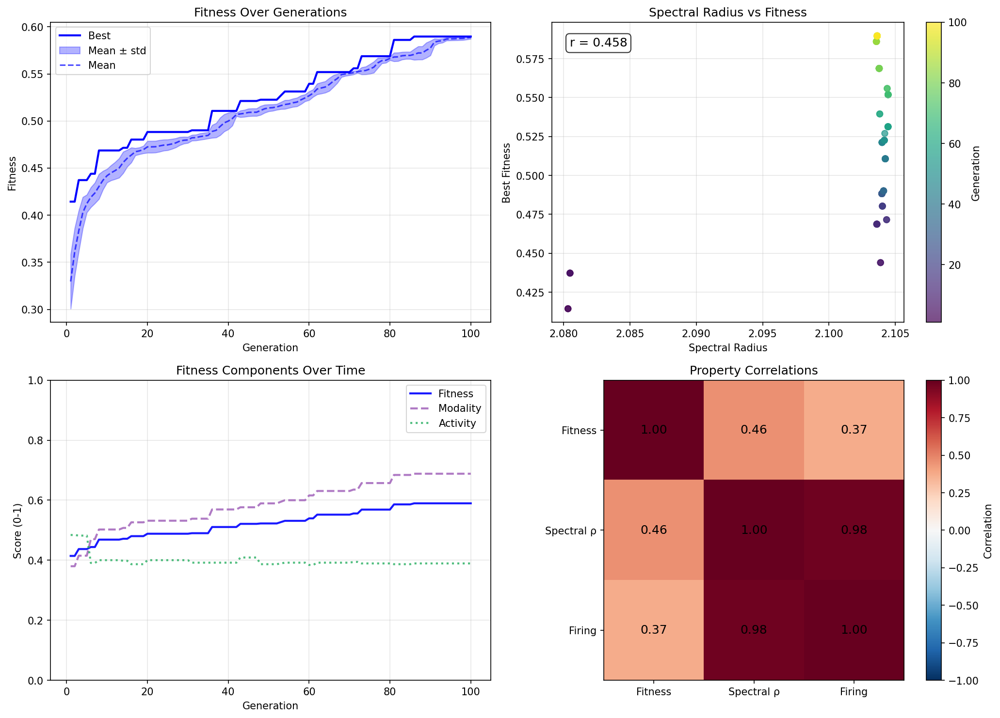
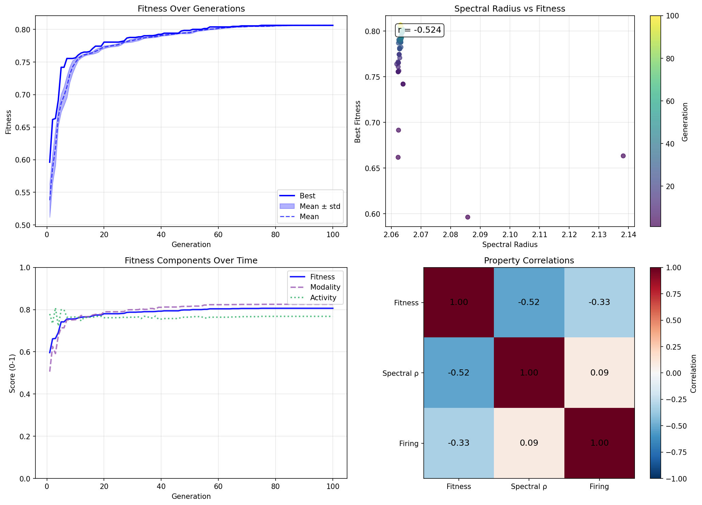

# Lab Notes: Neural Network Music Evolution

## Overview

Exploring evolutionary approaches to generating music from spiking neural networks. The core question: how to map network outputs to musical events in a way that's evolvable and musically meaningful.

---

## Output Encoding Experiments

### Pitch-Class Encoding (Original)

- 12 outputs per voice, each mapping to a chromatic pitch class
- Originally used percentile-based thresholding (e.g., 95th percentile triggers notes)
- Problem: Percentile thresholding guarantees activity — network can't learn to be sparse
- **Fix**: Switched to argmax selection — only the highest output per voice triggers, and only if it exceeds a minimum threshold (0.3). This lets the network control density.

### Motion Encoding (New)

- 8 outputs per voice: `[u1, u4, u7, d1, d3, d8, v1, v2]`
- Motion = `(u1×1 + u4×4 + u7×7) - (d1×1 + d3×3 + d8×8)`
- Competing forces model: up and down forces compete, net motion is the difference
- Velocity = `|v1 - v2|` (soft XOR — high when outputs differ)
- Interval weights `[1,4,7]` vs `[1,3,8]` chosen for musical intervals (minor 3rd, major 3rd, 5th, octave)

#### Thresholding Evolution

1. **Peak-relative threshold**: threshold = X% of peak velocity per voice
   - Problem: Highly volatile. Small parameter changes → huge activity swings
   - If peak is high but average low, almost nothing triggers
2. **Fixed threshold**: Simple constant (0.3)
   - Network controls activity directly — if outputs stay low, no notes; if high and differentiated, notes trigger

---

## Evolution Framework

### Race: Mutation vs Random Search

After observing that mutations often destroyed fitness, we implemented a direct comparison:

- 20 parents
- 50 offspring (mutations from parents)
- 50 fresh randoms

All compete; best 20 become next generation's parents. This lets us directly see whether mutation or random search is winning.

### Mutation Scale Issues

- Initial mutation scales were too high (1.0), effectively randomizing networks
- Reduced progressively: 1.0 → 0.05 → 0.01 → 0.001
- With gentler mutations, offspring scores cluster closer to parent scores

### Tracking & Visualization

- Parent coloring by creation method (mutation vs fresh random), not lineage
- Generation plots show fitness distribution of parents, offspring, randoms
- Median lines for fitness, modality, and activity (color-coded)
- Evolution history plot shows fitness components over time

---

## Evaluation Metrics

### Basic Evaluator (`eval_basic.py`)

Simplified from ambient evaluator to focus on two things:

1. **Modal consistency**: How well notes fit a scale (normalized so random chromatic ≈ 0)
2. **Activity**: Notes per beat per voice (target: 4 notes/beat/voice)

Weighting: 2:1 modal:activity (prioritize musicality over density)

### Key Fixes

- **Activity metric**: Changed from raw note count to notes/beat/voice
- **Modal consistency normalization**: Random chromatic baseline = 7/12 notes in any scale. Normalized so random scores ~0, perfect scale adherence scores ~1.
- **Min threshold**: Activity reward kicks in above certain density to prevent rewarding silence

---

## Key Insights

1. **SNNs are chaotic**: Small parameter changes can cause large, unpredictable output changes. This makes gradient-free optimization hard.

2. **Adaptive thresholds backfire**: Percentile-based or peak-relative thresholds remove the network's ability to control its own activity level. Fixed thresholds are better.

3. **Mutation is hard**: With the SNN's chaotic dynamics, even small mutations often degrade fitness. Random search competitive with mutation until scales are very small.

4. **Encoding matters**: Motion encoding vs pitch encoding have very different activity characteristics. The thresholding mechanism has outsized impact on evolvability.

---

### Motion Encoding

### Pitch Encoding

### Evolution History

## Best MIDI Downloads

[Download Best Motion MIDI](2026_01_19_media/gen090_best_0.5896_motion.mid)
[Download Best Pitch MIDI](2026_01_19_media/gen075_best_0.8063_pitch.mid)

---

## Current State

- Argmax pitch encoding with fixed min_threshold
- Fixed velocity threshold for motion encoding
- Race between mutation (scale=0.001) and random search
- Visualization shows fitness, modality, activity medians per generation
- History plot tracks all three metrics over evolution run
