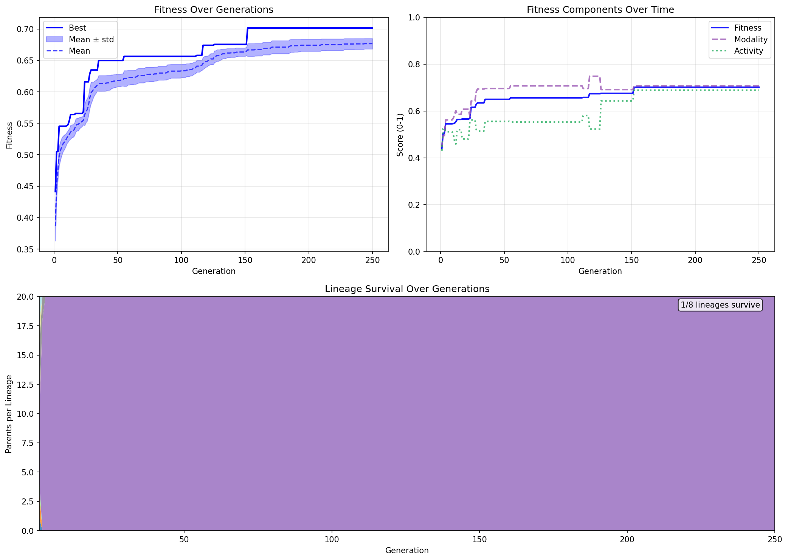

# Lab Notes: Topology Evolution, Activity Targeting & Lineage Analysis

**Date:** 2026-01-22

## Overview

Major session covering: mutation annealing strategies, fixing the activity ceiling problem, making network topology fully evolvable, weight thresholding for functional sparsity, and lineage tracking revealing premature convergence.

---

## Mutation Annealing Strategies

### Problem: Stagnation

Observed runs where parent age reached 376 generations with no improvement, then a breakthrough mutation 21 generations before end. Clear sign of getting stuck in local optima.

### Solution: Anneal Mutation Parameters Based on Parent Age

Added `AnnealStrategy` enum with 5 strategies:

- `NONE` — baseline, no annealing
- `SCALE_UP` — increase mutation scale as parent ages
- `SCALE_DOWN` — decrease mutation scale as parent ages
- `RATE_UP` — increase mutation rate as parent ages
- `RATE_DOWN` — decrease mutation rate as parent ages

Population split into 5 equal groups (20% each), each using different strategy. Allows direct comparison of which lever is more effective.

### Annealing Math

```python
annealed_value = base_value * (1 + anneal_factor * parent_age)
# Capped at anneal_max_multiplier * base_value
```

Initial settings too benign (`anneal_factor=0.02`). By generation 70, expected decreasing strategy to barely nudge, increasing strategy to find wild configurations. Increased to `anneal_factor=0.1` (user tested up to 0.2) with `anneal_max_multiplier=10.0`.

**Result:** More aggressive annealing produced actual variance in activity, better top scores, steeper learning curves.

---

## Removed Random Networks

After previous experiments showed mutation consistently outperforming random search, removed random injection entirely:

- `num_randoms = 0`
- `num_offspring = 100`

All offspring now come from mutation of the 20 parents.

---

## Activity Ceiling Problem

### Observation

Both encodings had activity stuck at fixed ceilings regardless of mutation:

- Pitch encoding: ~250 notes
- Motion encoding: ~100 notes

Added tracking for `output_max`, `output_min`, `outputs_above_threshold` to debug.

### Pitch Encoding

Argmax mapper means only 1 note per voice per timestep possible. With 4 voices × 128 steps, theoretical max = 512 notes. The 250 ceiling was actually reasonable — networks producing notes roughly half the time.

### Motion Encoding Root Cause

The velocity gate used XOR logic: `velocity = |v1 - v2|`, only triggering notes when `velocity > 0.3`.

**Problem:** XOR gate rarely opens. Requires one output high, one low. Most network states have both outputs similar, so velocity stays low and notes don't trigger.

### Fix: Simplified Velocity

Changed motion encoding from 8 outputs to 7:

- Old: `[u1, u4, u7, d1, d3, d8, v1, v2]` with `velocity = |v1 - v2|`
- New: `[u1, u4, u7, d1, d3, d8, v]` with `velocity = v`

**Result:** Note counts increased significantly. Motion encoding now competitive with pitch encoding.

---

## Activity Metric: From Minimum to Target

### Problem with Minimum Threshold

Original metric rewarded any activity above `min_note_density`. Networks could overshoot wildly with no penalty — just spam notes.

### Solution: Peaked Function

Changed to Gaussian-like function targeting exactly `sim_steps` total notes:

```python
target_note_density = self.target_notes / duration_beats / num_voices
ratio = note_density / target_note_density
score = np.exp(-0.5 * (np.log(ratio))**2)  # Gaussian in log-space
```

- Perfect score (1.0) when exactly hitting target
- Penalty for undershooting AND overshooting
- Zero notes = zero score
- Log-space makes penalties symmetric (2x too many = 0.5x too few)

**Result:** Both encodings now produce similar activity levels, both initially overshooting by ~2x, then evolving toward target.

---

## Fully Evolvable Topology

### Problem: Fixed Sparsity

The mutation code only mutated existing non-zero weights:

```python
mutate_mask = (np.random.rand(*self.network_weights.shape) < rate) & existing
```

Zero weights stayed zero forever — topology was locked at initialization.

### Fix: Remove the Mask

```python
mutate_mask = np.random.rand(*self.network_weights.shape) < rate
```

Now any weight can mutate, including zeros becoming non-zero. Network can form new connections.

**Observation:** Pitch encoding immediately showed more successful mutations than motion encoding after this change.

---

## Weight Thresholding for Functional Sparsity

### Problem: Runaway Density

With all weights evolvable, mutations can only add connections (zero → non-zero), never remove them (non-zero values won't randomly hit exactly zero). Networks become monotonically denser.

### Solution: Functional Threshold

Added `weight_threshold` parameter (default 0.05). During network tick, weights below threshold treated as zero:

```python
effective_weights = np.where(
    np.abs(state.network_weights) >= state.weight_threshold,
    state.network_weights, 0
)
incoming = effective_weights.T @ state.firing.astype(np.float64)
```

**Effect:**

- Stored weights can be any value
- Functional connectivity only includes weights ≥ 0.05
- Weak connections effectively pruned without explicit deletion
- Selection pressure can evolve toward sparsity (strong connections) or density (many weak connections)

---

## Refraction Period Mutation

Investigated `refraction_mutation_rate` — discrete mutation of neuron refractory periods. Values are integers (timesteps neuron stays inactive after firing).

Added small refraction mutation and observed much quicker fitness increase. Refractory periods affect timing/rhythm, complements weight mutations that affect activation patterns.

---

## Modality-Activity Tradeoff

**Observation:** Modality and activity metrics move in opposite directions during evolution.

**Hypothesis:** Fewer notes → easier to stay in scale (less chance for chromatic errors). More notes → more opportunities for wrong notes.

This suggests a Pareto frontier — can't maximize both simultaneously. Networks may be trading off between:

- High activity, lower modality
- Low activity, higher modality

May need multi-objective optimization (NSGA-II style) rather than weighted sum.

---

## Mutation Strategy: All 20 Parents

Confirmed that all 20 parents produce offspring, not just the top one. Each parent produces `num_offspring / num_parents` children (5 each with current settings), assigned to different annealing strategies.

---

## Lineage Tracking

### Implementation

Added `root_id` field to `Individual` — tracks the original gen-0 ancestor. Children inherit from parent. Added `lineage_counts` dict to `GenerationStats`.

### Visualization

New `plot_lineage_history()` creates stacked area chart:

- X-axis: Generation
- Y-axis: Number of parents from each lineage
- Shows which original lineages survive/dominate

### Key Finding: Premature Convergence

**One lineage dominates within ~5 generations.**

With (μ + λ) = (20 + 100), selection pressure is intense. No mechanism protects diversity. Population rapidly loses ability to explore alternatives.

---

## Speciation Discussion

### Why Speciation?

Premature convergence kills exploration. Speciation protects innovation by:

- Grouping similar individuals into species
- Species compete internally, not globally
- New species get time to optimize before competing with established ones

### Approaches Discussed

1. **Fitness Sharing** — divide fitness by lineage count, penalize dominant lineages
2. **NEAT-style Speciation** — genetic distance threshold, guaranteed slots per species
3. **Island Model** — separate populations with occasional migration
4. **Lower Selection Pressure** — increase μ or decrease λ

### Difference from Multiple Runs

Multiple independent runs: No information sharing, each converges separately.

Speciation: Single population with protected niches. Species can exchange innovations through crossover. Diversity maintained dynamically based on fitness landscape. Not seeing the benefit here without crossover though.

---

## Evolution History



## Best MIDI

[Download Best MIDI](2026_01_22_media/gen155_best_0.7015.mid)

---

## Simulation Vectorization

### Problem

Simulation was the bottleneck — 96% of evaluation time spent in nested Python loops:

```python
for i in range(num_neurons):
    for j in range(num_neurons):
        if firing[j]:
            incoming += weights[j, i]
```

With 256 neurons, that's 65K iterations per tick × 128 ticks = ~8M loop iterations per evaluation.

### Fix

Replaced with NumPy matrix-vector multiply:

```python
incoming = weights.T @ firing.astype(np.float64)
```

### Results

| Metric         | Before | After | Speedup |
| -------------- | ------ | ----- | ------- |
| Simulation     | 233ms  | 4ms   | **58x** |
| Full eval      | 242ms  | 12ms  | **20x** |
| Per generation | ~24s   | ~1.2s | **20x** |

Simulation no longer the bottleneck. Time now split evenly between simulation (34%), MIDI write (35%), and MIDI eval (30%).

---

## Code Changes Summary

1. `AnnealStrategy` enum and `compute_annealed_value()` helper
2. Population split into 5 strategy groups
3. `num_randoms = 0`, all offspring from mutation
4. Output stats tracking (`output_max`, `outputs_above_threshold`)
5. Motion encoding: 7 outputs with direct velocity (removed XOR gate)
6. Activity metric: peaked Gaussian targeting `sim_steps` notes
7. Removed `& existing` mask — all weights evolvable
8. `weight_threshold` in `NeuralNetwork.tick()` for functional sparsity
9. `root_id` on `Individual`, `lineage_counts` in `GenerationStats`
10. `plot_lineage_history()` stacked area visualization

---

## Open Questions

- Is the modality-activity tradeoff a fundamental Pareto frontier requiring multi-objective selection?
- Would fitness sharing preserve enough diversity without sacrificing convergence?
- What genetic distance threshold creates meaningful species boundaries?
- Can speciation help escape the early plateau?
- How do different weight_threshold values affect evolved network structure?
- Should refraction periods be more aggressively mutated given their impact?
