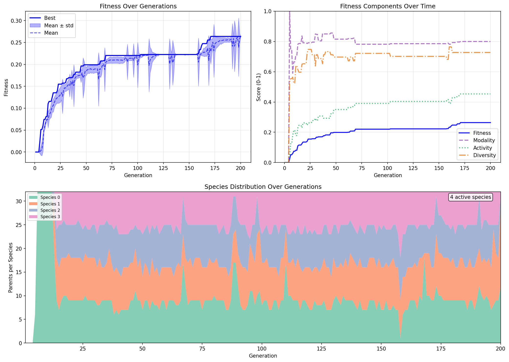
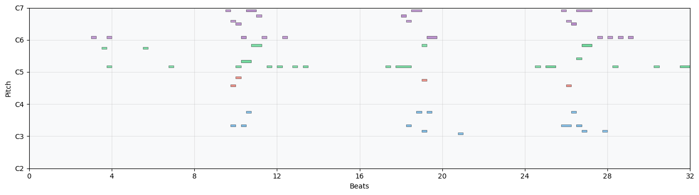
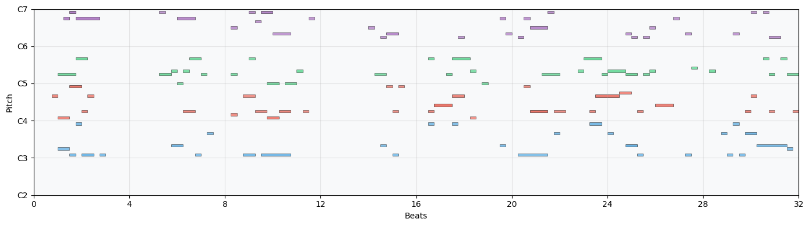

# Lab Notes - Speciation and Other Experiments

**Date:** 2026-01-24

## Per-Voice Diversity Metrics

The global diversity metric was being gamed: each voice would repeat a single note, but since different voices played different notes, the combined pitch class entropy was decent. Fixed by computing diversity **per voice** and taking the **minimum** across voices.

```python
# Old: global diversity across all notes
diversity = compute_diversity(all_notes)

# New: per-voice, minimum wins
voice_diversities = [compute_diversity(voice_notes) for voice in voices]
diversity = min(voice_diversities)
```

An old "high scorer" (0.86) that had 4 voices each repeating one note now scores 0.0 diversity. Good.

## The Regular Spike Train Problem

Even with per-voice diversity, networks converged to regular "spike trains" - each voice firing every other step. Root cause: **minimum refractory period of 2 steps**.

With `refraction_period=2`:

- Step 0: neuron fires, counter=2
- Step 1: refractory, can't fire
- Step 2: counter=0, fires again
- ...repeat forever

This is the **only stable attractor** the network can find because:

- Sparse connectivity (2.5-5% density)
- Activation decay (0.9^n per step)
- Without fast oscillation, activity dies out

## Activation Leak vs Refractory Period

The interplay between `activation_leak` and `refraction_period` determines whether activity can sustain:

| Refraction | Leak=0.90 | Leak=0.95 | Leak=0.98 |
| ---------- | --------- | --------- | --------- |
| 2 steps    | 0.81      | 0.90      | 0.96      |
| 4 steps    | 0.66      | 0.81      | 0.92      |

With refraction=4 and leak=0.90, only 66% of activation survives - not enough with sparse networks. Increased to leak=0.98.

## Changes Made

### Refractory Period

- Increased minimum from 2 to 4 steps
- Both in `NetworkGenotype.random()` and mutation clipping

### Activation Leak

- Increased from 0.90 to 0.98
- Allows activity to persist across longer refractory periods

### Hyperparameter Consolidation

Created single source of truth in `network.py`:

```python
DEFAULT_NUM_NEURONS = 256
DEFAULT_NUM_READOUTS = 4
DEFAULT_N_OUTPUTS_PER_READOUT = 12
DEFAULT_ACTIVATION_LEAK = 0.98
DEFAULT_REFRACTION_LEAK = 0.75
DEFAULT_WEIGHT_THRESHOLD = 0.05
DEFAULT_NETWORK_SPARSITY = 0.05
DEFAULT_NETWORK_WEIGHT_SCALE = 0.4
DEFAULT_OUTPUT_SPARSITY = 0.025
DEFAULT_OUTPUT_WEIGHT_SCALE = 0.2
DEFAULT_REFRACTION_PERIOD = 4
DEFAULT_REFRACTION_VARIATION = 30
```

Removed redundant parameters from function signatures:

- `to_network()` now takes no params - uses constants directly
- `random()` only takes architecture params (`num_neurons`, `num_readouts`, `n_outputs_per_readout`) since those are actually overridden in some places

### params.txt

Each evolution run now saves `params.txt` with all hyperparameters. Imports constants directly - no introspection tricks.

## Observations

### Speciation

Tried it, didn't help with repetitive patterns. The problem is in the fitness landscape, not population diversity. Disabled.

### Simulation Length

Tried 16 steps instead of 128 for faster iteration. `sim_steps` in config propagates to:

- Simulation loop
- Activity target (`target_notes = sim_steps`)
- Piano roll duration

## Key Insight

The network physics (leak rates, refractory periods, sparsity) have **much larger effect** than mutation characteristics. The hyperparameter space is huge. Having `params.txt` for each run is essential for tracking what actually worked.

## Sample Run Graphs





## Next Steps

- Still seeing some short pulse trains even with refraction=4
- Multiple neurons can feed the same output pitch, creating consecutive pulses despite per-neuron refractory
- Could add IOI (inter-onset interval) regularity penalty
- Or penalize when multiple neurons converge on same output
